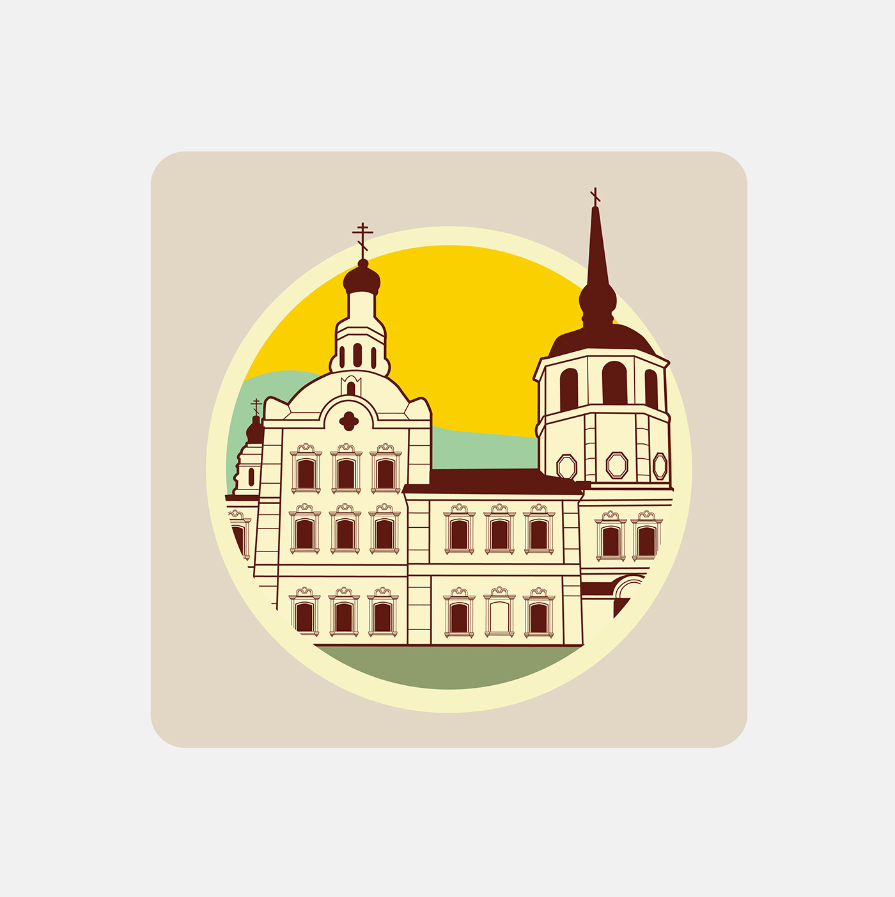
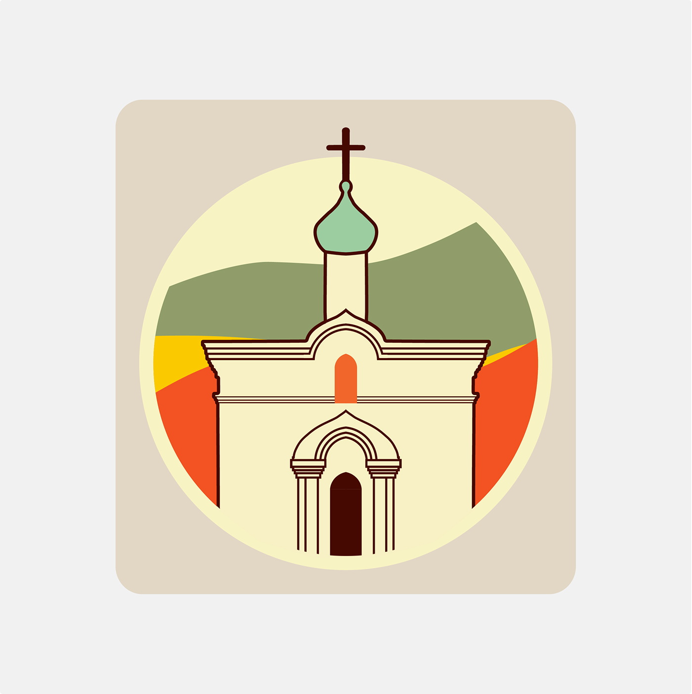
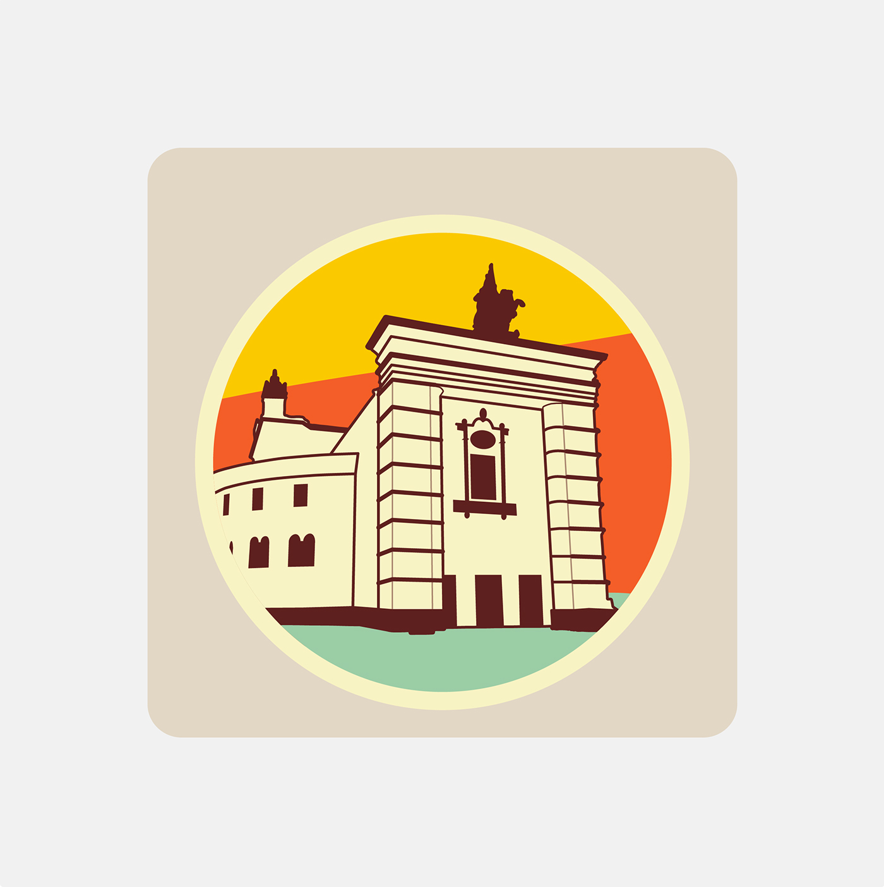

# Uu-map
Map of Ulan-ude with touristic routes and historical sights (Work in progress)

Inspired by http://urban-walks.com/#tours

Here we have a map of Ulan-Ude's center. The main element here is a background that consists of places' names and graphics. Some trees and cars for amusement. 

Very important elements of our app are icons for routes' key points. And of course those icons depict places they belong to: sculptures, buildings, churches, theaters etc.

